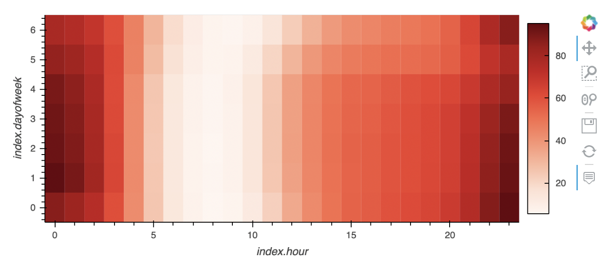
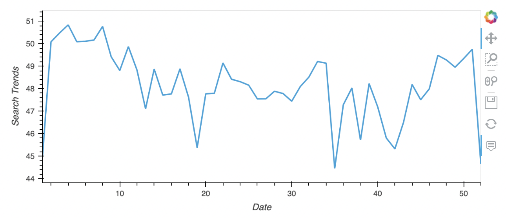
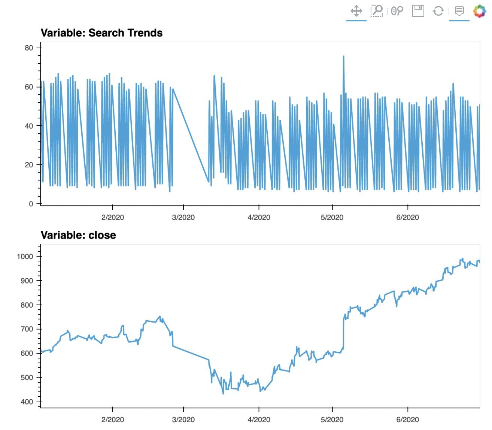
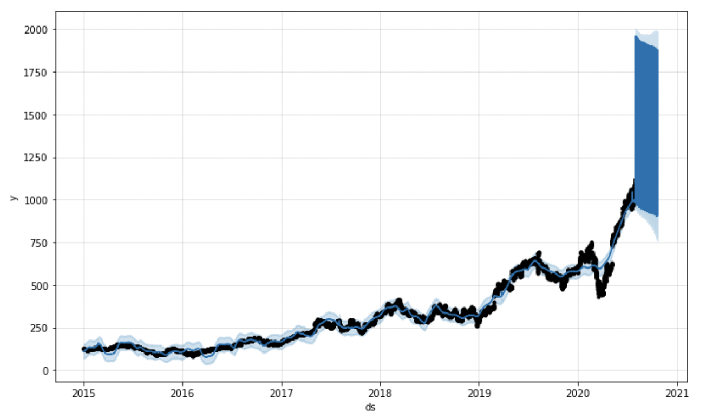
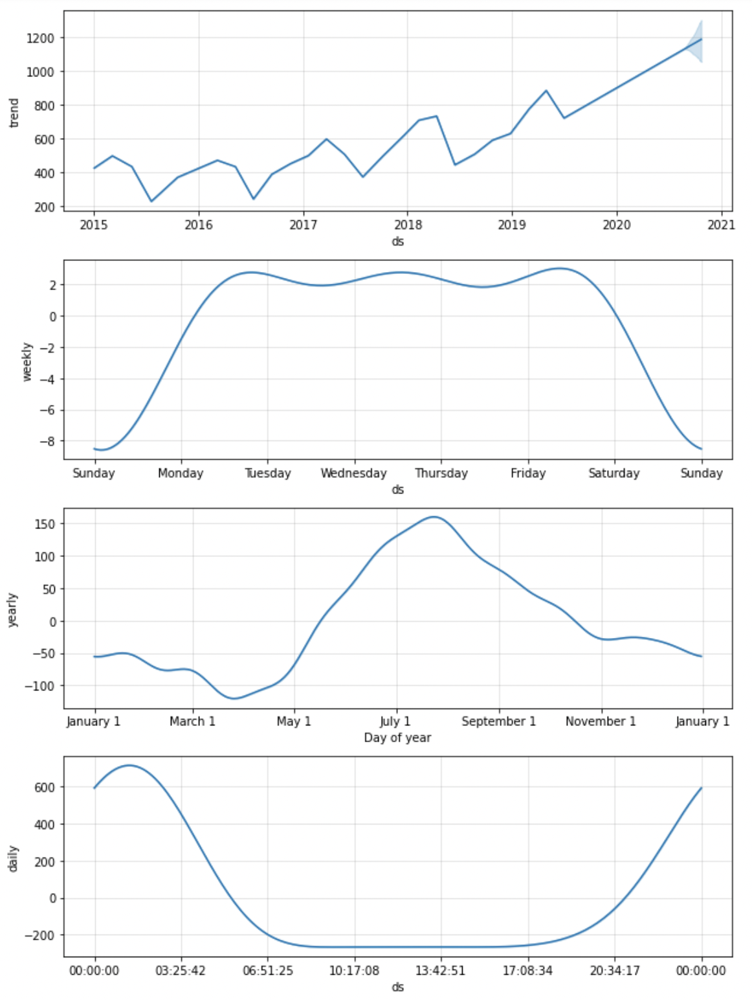

# 11_MercadoLibre_Analysis

### This project aims to perform a time series analysis using Prophet for MercadoLibre, the most popular e-commerce site in Latin America. By analying past search traffic data, I want to see if this can be translated into the ability to successfully trade the stock.

---

## Technologies

This project leverages python 3.9 and [Google Colab](https://colab.research.google.com/?utm_source=scs-index) was used to run all analysis.

---

## Installations

Before running the application first install and import the following libraries and dependencies.

```python
!pip install pystan
!pip install fbprophet
!pip install hvplot
!pip install holoviews

import pandas as pd
import holoviews as hv
from fbprophet import Prophet
import hvplot.pandas
import datetime as dt
import numpy as np
%matplotlib inline
```

---

## Finding Unsual Patters in Hourly Google Search Traffic

First step in the data analysis was to identify if the Google search traffic for MercadoLibre is linked to any financial events at the company, or does the search traffic just presents random noise.

To analyze this, the dataframe was sliced to only look at May 2020 data since this was the month that MercadoLibre released its quarterly financial results.

Upon calculating the median search traffic for May and across all months, it was evident that the search traffic did increase during May when MercadoLibre's financial results were released. The the overall monthly median value of 35172.5 and the month of May's was 38181.

---

## Mine the Search Traffic Data for Seasonality

Second step was to mine the search traffic data for predictable seasonal patters of interest in the company. This was done by looking at the hourly data of the week and then weekly data of the year.

By using a heatmap, we were able to see that Mondays and Sundays around 11pm and midnight have the highest search trends. Tuesdays through Thursdays also have significant traffic in the same time period.



When looking at weekly data, especially during the holiday season of weeks 40-52, there were also obvious increase of search traffic trend.



---

## Search Traffic and Stock Price Patterns

Next, it was important to understand if there is any relationship between the search data and the company stock price, especially since the pandemic started in 2020.

The first half of 2020's data was analyzed and compared to the search trends of the same period:



The price of the stock definitely demonstrated an increase after the pandemic, however, the search trends remained fairly the same as pre-pandemic, in fact, a bit lower, and then a spike around beginning of May, and then returned to around the same traffic trends middle of May.

Correlation between stock volatility and lagged search trends also indicated weak negative correlation (-0.148938). There was a positive correlation of 0.017929 between lagged search traffic and the hourly stock return but it is also very weak.

---

## Time Series Model with Prophet

Finally, the Prophet forecasting model was used to analyze and forecast patterns in the hourly search data of MercadoLibre.

Note: when preparing the data, t is important to label the columns as `ds` and `y` so it is recognizeable by Prophet.

Below is the Prophet predictions for the MercadoLibre trends data:



It has a positive outlook for the near-term forecast for the popularity of MercadoLibre. It is predicted to continue growing for the rest of 2020, hitting all-time new highs.

To look at the patterns of the individual time series, the plots for the year, month, week, and hourly were produced.



Through these plots, it seems that around 1-1:30am of the day exhibited the greatest popularity. Friday seems to get the most search traffic and the lowest point for search traffic was around end of March/April time.

Therefore, these plots and patterns would be worthy of note when analyzing the search traffic.
